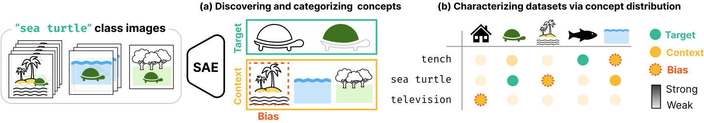

# ConceptScope: Characterizing Dataset Bias via Disentangled Visual Concepts
**Official Repository – NeurIPS 2025**


<p align="center">
  <a href="https://jjho-choi.github.io/ConcepScope-projectpage/">🌐 Project Page</a> |
  <a href="https://drive.google.com/file/d/1OuSB27qIxaXUpn0tXUvWW7irv-56rYoM/preview">🎬 Demo Video</a> |
  <a href="#run-demo">🚀 Run Interactive Demo</a>
</p>
<div align="center">
  
</div>

ConceptScope is a framework for analyzing vision dataset bias by uncovering and quantifying visual concepts using Sparse Autoencoders (SAEs).
This repository provides:
- Training SAEs on vision models (e.g., CLIP) and extracting meaningful latent concepts

- Categorizing concepts into target, context, and bias types

- Evaluating concept prediction and segmentation, and benchmarking bias discovery tasks

- An interactive demo for visualizing and analyzing dataset bias

## Table of Contents

- [Getting Started](#getting-started)
- [Run Demo](#run-demo)
- [Train SAE](#train-sae)
- [Construct Concept Dictionary](#construct-concept-dictionary)
- [ConceptScope Analysis](#conceptscope)
- [Evaluation](#evaluation)


## Getting Started 
### 1. Set Up the Environment

Create and activate a Conda environment, then install the required dependencies:
~~~
conda create --name conceptscope python=3.11
conda activate conceptscope 

pip install -r requirements.txt
~~~

### 2. Download Weights and Data
To reproduce the paper results without running the full analysis, you can directly download the pretrained SAE weights and pre-computed outputs as follows:
~~~
gdown 1NJzF8PriKz_mopBY4l8_44R0FVi2uw2g  # out.zip
unzip out.zip
~~~

If you wish to analyze the ImageNet dataset, download the pre-computed SAE latents as follows:
~~~
gdown 1NJzF8PriKz_mopBY4l8_44R0FVi2uw2g  # train_sae_latents.h5
mv train_sae_latents.h5 out/checkpoints/openai_l14_32k_base
~~~

>⚠️ Note: The SAE latent file from the ImageNet training set is approximately 32 GB in size.


## Run Demo 

This demo provides an **interactive UI** for exploring concepts discovered by ConceptScope.  
It allows you to:

- Select a dataset and class
- Visualize the distribution of **target**, **context**, and **bias** concepts
- Inspect **high-activation** and **low-activation** samples for any selected latent

### Requirements
- **Trained SAE checkpoint** (from `train_sae.py`)
- **Concept categorization results** (from `main.py` in `conceptscope/`)


### Launching the Demo

#### 1. Set Up Environment Variables

Create a `.env` file in the project root and set the following variables:

```bash
VISUALIZER_ROOT="<project_root>/ConceptScope"
DEVICE="cuda:<your_device_number>"
PORT="<your_port>"
CHECKPOINT_NAME="<checkpoint_name>"
```

#### 1. Start the Backend

From the project root, run:

```bash
PYTHONPATH=./ uvicorn src.demo.backend.main:app --port <PORT> --reload
```
#### 2. Start the Front 
In a separate terminal, run:
```bash
PYTHONPATH=./ streamlit run src/demo/frontend/streamlit_app.py
```

Once running, Streamlit will provide a local URL (e.g. http://localhost:8501). Open it in your browser to access the UI.


## Train SAE 
This step trains a Sparse Autoencoder (SAE) on a specified vision backbone (e.g., CLIP ViT-L/14) to learn a disentangled latent representation.

### Run

Example training command:

```bash
PYTHONPATH=./ python src/sae_training/train_sae.py \
    --device cuda:0 \
    --block_layer -2 \
    --use_ghost_grads \
    --seed 1 \
    --n_checkpoints 1 \
    --total_training_tokens 5000000 \
    --log_to_wandb \
    --model_name openai/clip-vit-large-patch14 \
    --expansion_factor 32 \
    --clip_dim 1024 \
    --dataset imagenet \
    --b_dec_init_method geometric_median \
    --lr 0.0004 \
    --l1_coefficient 0.00008 \
    --batch_size 64 \
```

### Key arguments
| Argument                  | Description                                                       | Default                         |
| ------------------------- | ----------------------------------------------------------------- | ------------------------------- |
| `--model_name`            | HuggingFace model name or path to a local checkpoint              | `openai/clip-vit-large-patch14` |
| `--block_layer`           | Transformer block layer index to extract activations from         | `-2`                            |
| `--clip_dim`              | CLIP embedding dimension (e.g., 1024 for ViT-L/14)                | `1024`                          |
| `--expansion_factor`      | SAE expansion factor (number of latents per input dimension)      | `32`                            |
| `--b_dec_init_method`     | Initialization method for decoder bias (e.g., `geometric_median`) | `geometric_median`              |
| `--l1_coefficient`        | L1 penalty weight for sparsity                                    | `0.00008`                       |
| `--total_training_tokens` | Total number of tokens to train over                              | `50000000`                      |
| `--use_ghost_grads`       | Enable ghost gradients to prevent dead neurons                    | *disabled*                      |


### Outputs

- SAE checkpoint (`.pt`) stored under `out/checkpoints/experiment_id`
- Training logs & metrics (optionally logged to Weights & Biases)

### Notes
- To train on a custom dataset, add it to the `load_dataset` function in `src/utils/image_dataset_loader.py`.

---

## Construct Concept dictionary 
This step extract meaningful latent from the trained SAE and assign semantic labels using reference images and VLMs. It can also save SAE activations for later analysis.


### Requirements

- Trained SAE checkpoint (`.pt`)
- Dataset for activation extraction (e.g., ImageNet validation split)


### Run
Example command:

```bash
PYTHONPATH=./ python src/construct_concept_dict/main.py \
    --device cuda:1 \
    --sae_path ./out/checkpoints/openai_l14_32K_base/clip-vit-large-patch14_-2_resid_32768.pt \
    --batch_size 128 \
    --dataset_name imagenet \
    --split val \
    --use_gpt \
    --save_features
```

### Key arguments

| Argument          | Type   | Default                         | Description                                             |
| ----------------- | ------ | ------------------------------- | ------------------------------------------------------- |
| `--dataset_name`  | `str`  | `imagenet`                      | Name of the dataset to process                          |
| `--sae_path`      | `str`  | **(required)**                  | Path to the trained SAE checkpoint                      |
| `--backbone`      | `str`  | `openai/clip-vit-large-patch14` | Backbone model type used during SAE training            |
| `--seed`          | `int`  | `1`                             | Random seed for reproducibility                         |
| `--split`         | `str`  | `train`                         | Dataset split to process (`train`, `val`, `test`)       |
| `--device`        | `str`  | `cuda`                          | Device to run on (`cpu` or `cuda`)                      |
| `--use_gpt`       | `flag` | *disabled*                      | If set, use GPT to generate human-readable latent names |
| `--batch_size`    | `int`  | `64`                            | Batch size for processing                               |
| `--save_features` | `flag` | *disabled*                      | If set, save extracted features for later use           |


### Outputs
- `valid_latent.json` – indices of meaningful latents
- `concept_dict.json` (optional) – human-readable names if --use_gpt is enabled
- `<split>_sae_latents.h5` (optional) – cached activations for downstream analysis if --save_features is used


## ConceptScope 
This module runs **ConceptScope analysis** on a given dataset using a trained SAE. It computes alignment scores, categorizes latents into **target**, **context**, and **bias** concepts, and saves the results for downstream bias analysis and visualization.

### Requirements

- **Trained SAE checkpoint** (`.pt`)  
- **Dataset** (e.g., ImageNet, NICO, COCO) accessible locally or via huggingface `datasets`  

### Run

Example command:

```bash
PYTHONPATH=./ python src/conceptscope/main.py \
    --device cuda:0 \
    --sae_path ./out/checkpoints/openai_l14_32K_base/clip-vit-large-patch14_-2_resid_32768.pt \
    --dataset_name imagenet \
    --split train \
    --batch_size 128 \
    --num_samples 128 \
    --target_threshold 1.0 \
    --clip_model_name openai/clip-vit-large-patch14
```

### Key arguments 
| Argument             | Type    | Default                         | Description                                                             |
| -------------------- | ------- | ------------------------------- | ----------------------------------------------------------------------- |
| `--save_root`        | `str`   | `./out`                         | Root directory to save results                                          |
| `--dir_name`         | `str`   | `dataset_analysis`              | Subdirectory name for results                                           |
| `--sae_path`         | `str`   | **(required)**                  | Path to the trained SAE checkpoint                                      |
| `--device`           | `str`   | `cuda`                          | Device to run the model on (`cpu` or `cuda`)                            |
| `--backbone`         | `str`   | `openai/clip-vit-large-patch14` | Backbone model used during SAE training                                 |
| `--clip_model_name`  | `str`   | `openai/clip-vit-large-patch14` | CLIP model for similarity computation                                   |
| `--dataset_name`     | `str`   | `imagenet`                      | Name of the dataset to analyze                                          |
| `--split`            | `str`   | `train`                         | Dataset split to analyze (`train`, `val`, `test`)                       |
| `--target_attribute` | `str`   | `None`                          | Optional target attribute for subgroup analysis                         |
| `--batch_size`       | `int`   | `64`                            | Batch size for processing                                               |
| `--num_samples`      | `int`   | `256`                           | Number of samples to compute alignment scores                                            |
|`--target_threshold` | `float` | `0.0`                           | Alignment score threshold for marking a latent as **target** |
|`--bias_threshold_sigma` | `float` | `1.0`                           | Multiplier for the standard deviation used to determine the concept strength threshold for marking a latent as **bias** |

### Outputs 
- `<split>_concept_categorization.json`: dictionary with per-class lists of target, context, and bias latents.
- Each latent entry contains:
```
{"target":
    [ 
        {
            "latent_idx": 123,
            "latent_name": "striped_pattern",
            "alignment_score": 0.73,
            "mean_activation": 0.012,
            "normalized_alignment_score": 1.42,
        }, ... 
    ]
}

```

### Notes 
- Increasing `--target_threshold` makes target concepts more selective
- Adjust `--bias_threshold_sigma`  if you want stricter or looser bias detection.


## Evaluation 
Further details are can be seen in [Evaluation Guide](./src/experiments/README.md).
